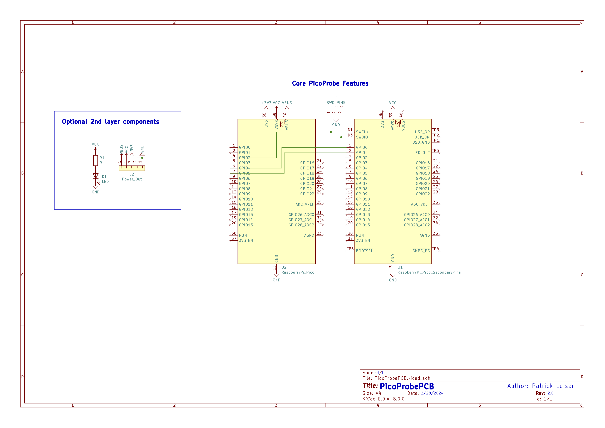
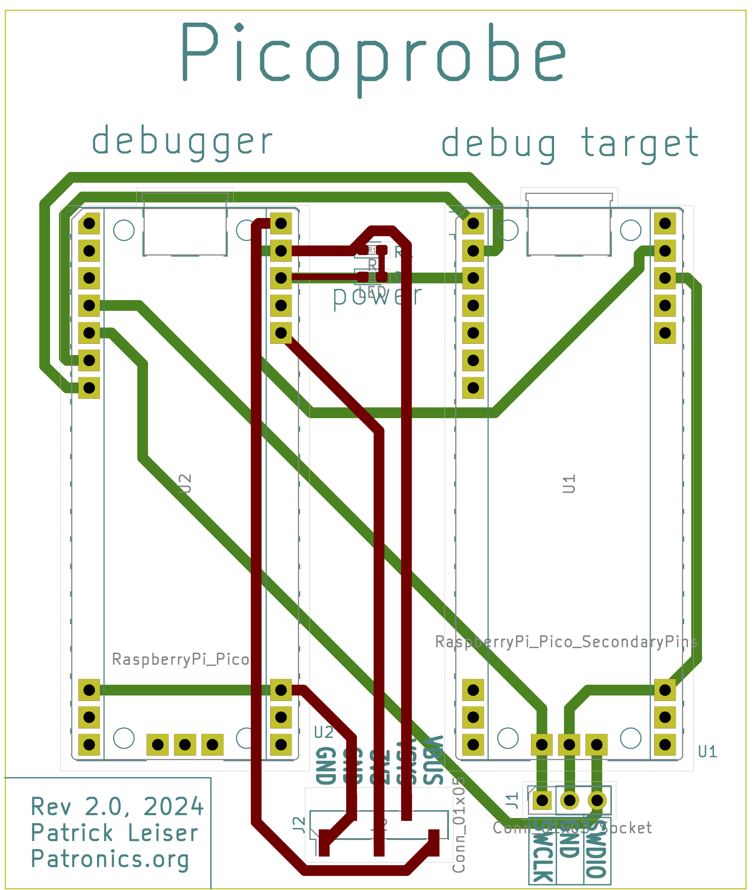

## PicoProbePCB
A simple, minimal PCB for making a Rasberry Pi Picoprobe, designed for ease of machining with a single layer, yet with optional additional features if produced with multi-layer PCBs.  

#### Schematic

#### PCB Layout

