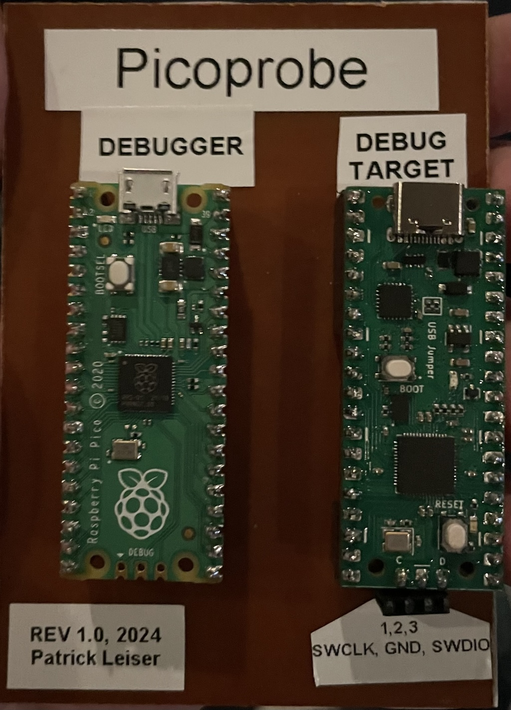
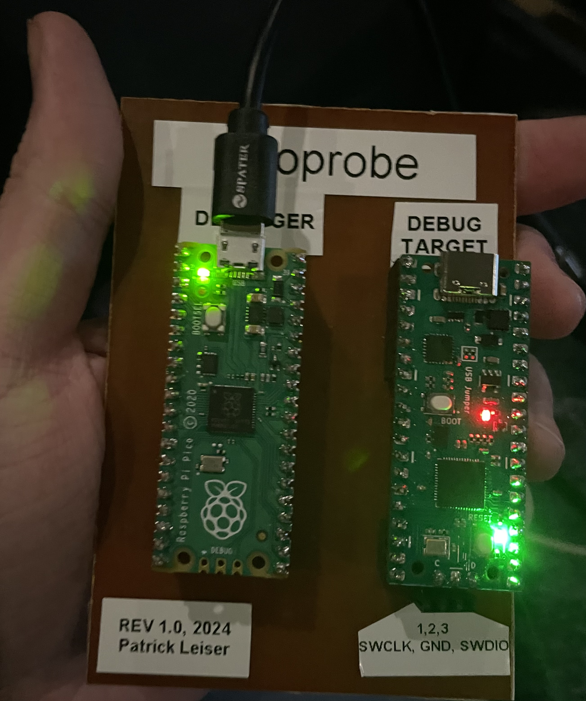

# PicoProbePCB
A simple, minimal PCB for making a Rasberry Pi Picoprobe, designed for ease of machining with a single layer, yet with optional additional features (A power LED and some power breakouts) if produced as a two-layer PCB.  

### Design
|Schematic   |   PCB Layout   |   Single Layer Layout   |
|:-------:   |    :------:    |   :-----------------:   |
||||

### Images
| Rev 2  PCB Render   |  Rev 1 single-sided off | Rev 1 single-sided (active)|
| :---: | :---: | :---:|
|| ||

The single-sided version was machined using my homemade CNC Machine
