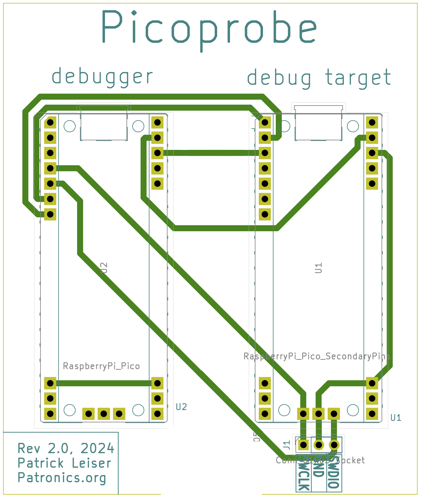
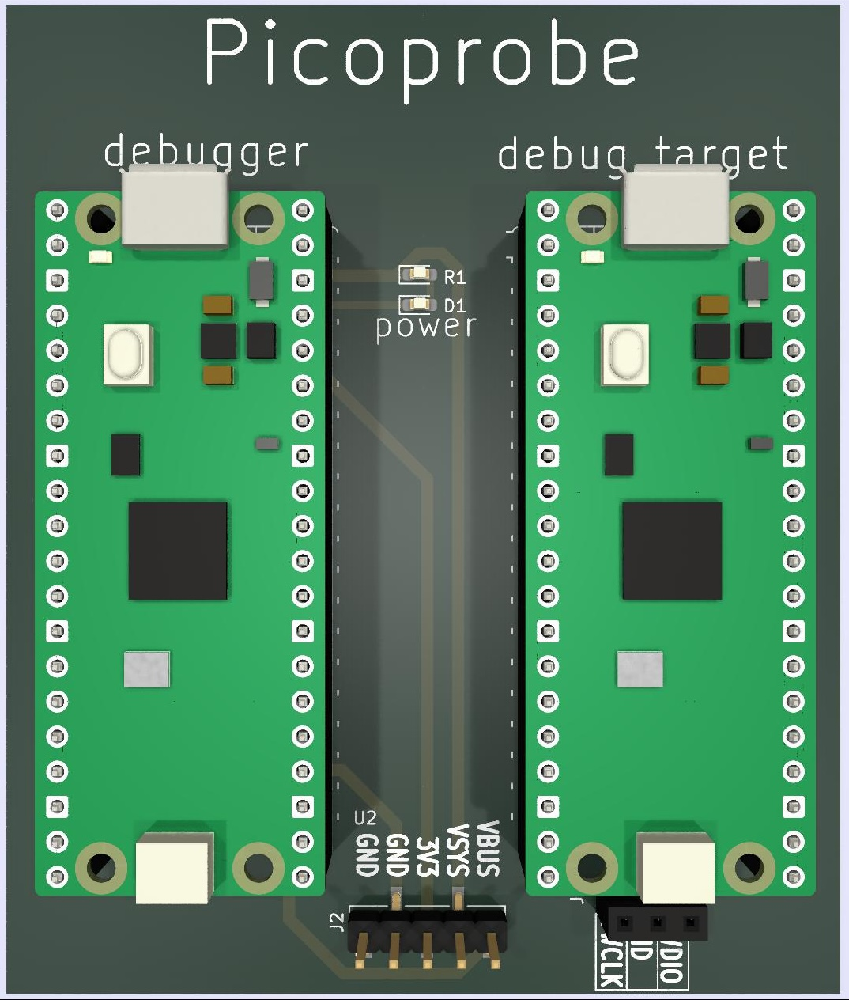

## PicoProbePCB
A simple, minimal PCB for making a Rasberry Pi Picoprobe, designed for ease of machining with a single layer, yet with optional additional features (A power LED and some power breakouts) if produced as a two-layer PCB.  

#### Design
|Schematic   |   PCB Layout   |   Single Layer Layout   |   PCB Render   |
|:-------:   |    :------:    |   :-----------------:   |   :---------:  |
|||||

### Rev 1 Photos
This single-sided version was machined using my homemade CNC Machine:

|
